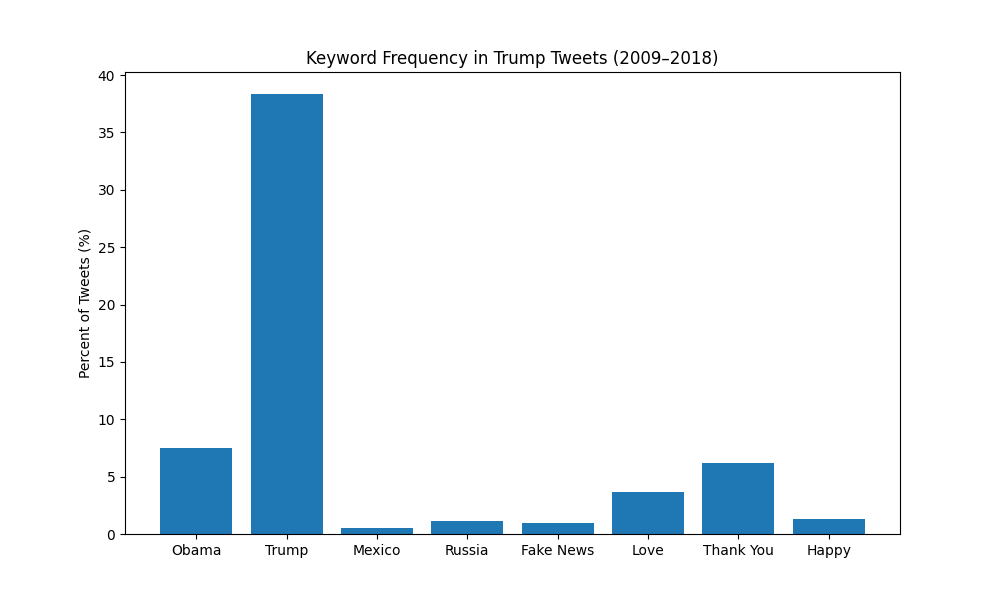

## Keyword Frequency in Trump Tweets (2009–2018)

The table below shows how frequently each keyword appeared in Trump's tweets from 2009 to 2018.

| phrase            | percent of tweets |
| ----------------- | ----------------- |
|             obama | 07.47             |
|             trump | 38.35             |
|            mexico | 00.55             |
|            russia | 01.13             |
|         fake news | 00.92             |
|              love | 03.67             |
|         thank you | 06.21             |
|             happy | 01.26             |

